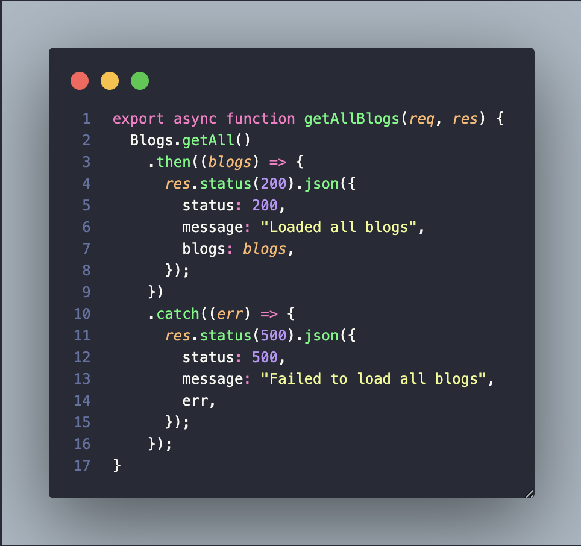
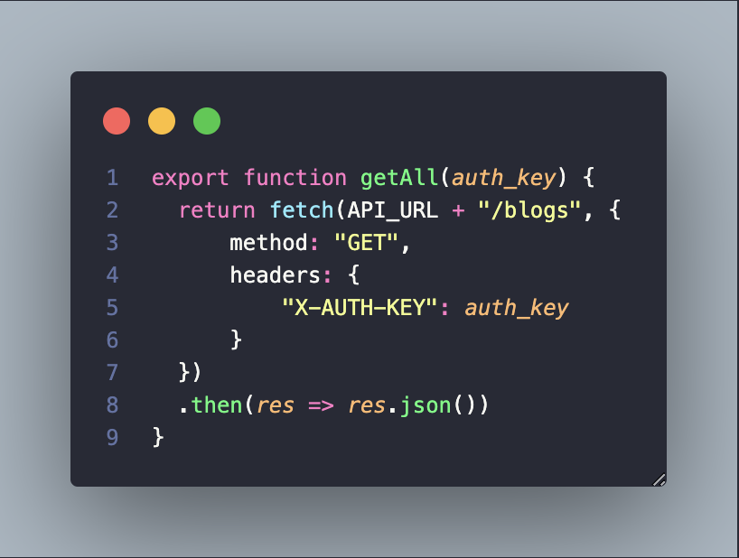
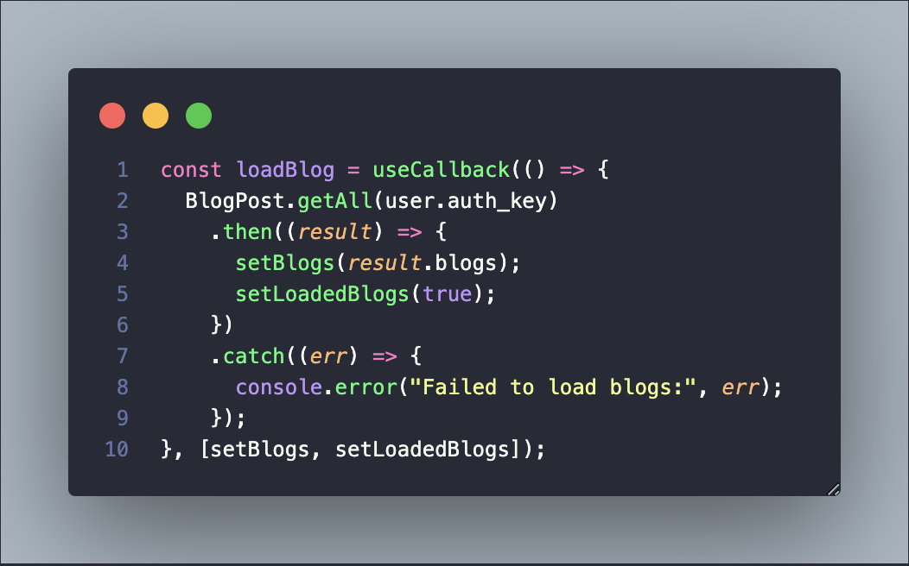
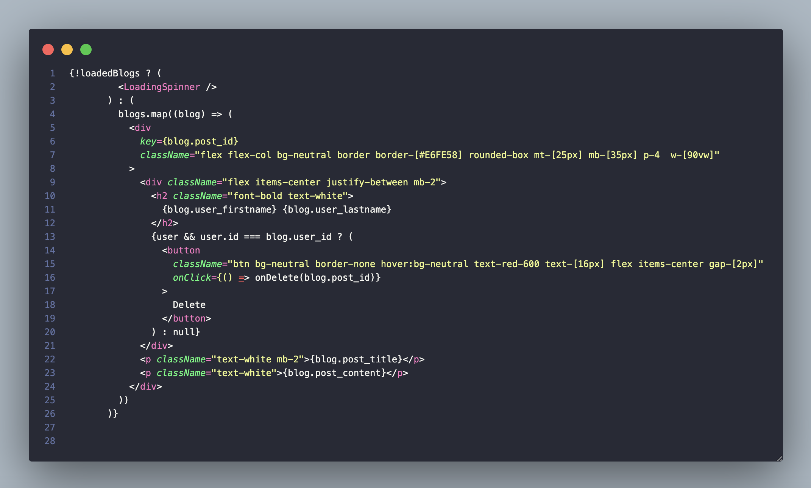

## Getting Started
To get started with the **High Street Gym Web Application**, follow these steps:

### 1. Install dependencies:
```bash
npm install
```

### 2. Set up your database:
- Import the sample database in: mysql_dump/high-street-gym-db.sql
- Configure the database connection in: backend/src/database.js

### 3. Start the backend API server:
```bash
npm run backend
```

### 4. Start the frontend vite development server:
```bash
npm run frontend
```

## Displaying All Blogs
### Backend


Blog data is retrieved from the database through `Blogs.getAll()`. The `getAllBlogs()` controller handles the response with appropriate HTTP status codes:
- Returns `200 OK` with a message and blog data on success.
- Returns `500 Internal Server Error` with an error message on failure.
The response is formatted as JSON for using in the frontend.

### API Call


The `fetch()` method is used to connect the frontend with the backend by sending a `GET` request to the `/blogs` endpoint. The request includes an `X-AUTH-KEY` header, which is used by the backend middleware to authenticate and authorise the user. Once successful validation, the server returns blog data in JSON format, allowing the frontend to dynamically display the blog posts. 

### React Integration 


After retrieving blog data from the backend using `BlogPost.getAll(user.auth_key)`, the data is stored in the component state using `setBlogs()`, and the `loadedBlogs` is set to `true` to indicate that the blog data has been successfully loaded. 

### Blog UI Rendering


While fetching blog data, a loading spinner is displayed. After loading, the blogs are rendered by mapping through the `blogs` array with each post's title, content, and author name. If the logged-in user is the author, a delete button is displayed to remove their own posts.
